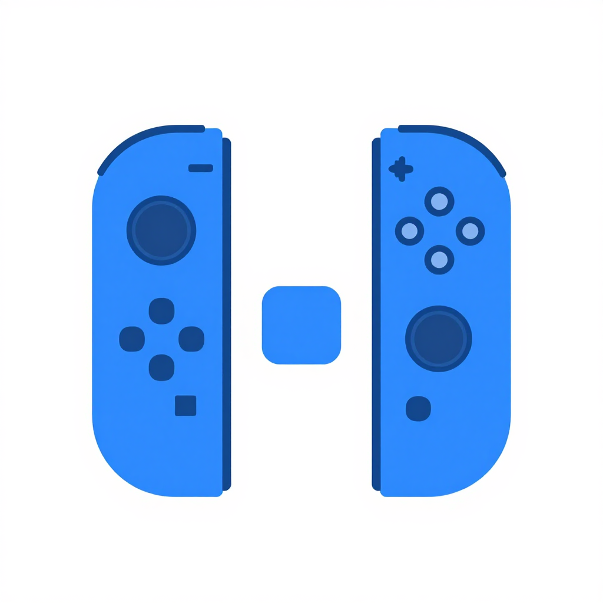

<p align="center">
  
</p>

<h1 align="center">Joyride</h1>

<p align="center">
  A native macOS menu bar utility that maps Nintendo Switch <strong>Joy-Con</strong> inputs
  to system-wide keyboard, mouse, and <strong>mouse scroll</strong> events.
</p>


## Building


Requires macOS 13+ and Swift 5.9+ (ships with Xcode 15 / Command Line Tools).

```bash
./scripts/build-app.sh
open build/Joyride.app
```

For a universal binary:

```bash
ARCHS="arm64 x86_64" ./scripts/build-app.sh
```

For dev iteration without bundling:

```bash
swift run
```

Note: `swift run` launches without an `.app` bundle, so the Accessibility permission may
not persist between runs. Use the build script for real testing.

## First-run setup

1. **Pair a Joy-Con.** Hold the tiny sync button on the side of a Joy-Con until the four
   LEDs blink, then add it from *System Settings → Bluetooth*. It will appear as
   "Joy-Con (L)" or "Joy-Con (R)".
2. **Grant Accessibility.** On first launch macOS will prompt. Go to *System Settings →
   Privacy & Security → Accessibility* and enable `Joyride`.
3. **Open the menu bar icon** (gamecontroller symbol) to see connected devices and pick
   a profile. Click *Open Mapping Editor…* to customize bindings.

## Built-in profiles

- **Scrolling** — A/B/X/Y mapped to scroll down/up, with D-pad scroll on the left Joy-Con.
  R/ZR are left/right click. Sticks drive the mouse cursor.
- **Gaming** — WASD on the D-pad, R/ZR left/right click, A=Space, B=Return, X=E, Y=Q.
- **Presentation** — A/B page right/left, X/Y page up/down. +/Home = space/esc.

## Key bindings

Each button can trigger a key combo, a mouse click, or a scroll action. For key
combos, all five macOS modifiers are available — `⌃ Control`, `⌥ Option`,
`⇧ Shift`, `⌘ Command`, and `fn` (the Globe key). The `fn` modifier is handy
for system combos like `fn+F` (Full Screen), `fn+E` (Emoji & Symbols), or
`fn+A` (Accessibility Shortcuts).

## Stick calibration

Joy-Con sticks drift over time — the reported "center" creeps off 0 (cursor
crawls at rest) and the reported "range" shrinks (cursor never hits full speed).
Joyride fixes both with a short guided calibration. Open *Mapping Editor → Live
Input Preview* for each connected controller and click **Calibrate…**:

1. **Step 1 — Rest.** Leave both sticks alone for about 0.8 s while Joyride
   averages their raw readings to establish a provisional center.
2. **Step 2 — Roll.** Rotate each stick in full circles for up to 5 s. An 8-dot
   coverage ring lights up as you sweep through each 45° arc; when all eight
   dots are green, calibration auto-completes. Joyride records the min/max raw
   reading on each axis during the roll and uses the midpoint of those bounds
   as the true center and the half-span as the new range — so the normalized
   stick output hits exactly ±1.0 at your particular controller's mechanical
   limits, without over-saturating from a wobble or under-using the travel.

If you only cover part of the rotation, Joyride falls back to the rest-phase
center (better than factory, but keeps the existing range). The panel shows
live `raw` values and a `Δ` drift indicator that turns orange when the stick is
measurably off-center, so you can see at a glance whether recalibration would
help.

Calibration is stored per-device (keyed by serial number) in
`~/Library/Application Support/Joyride/calibration.json`, with a per-side
fallback so a freshly-paired same-side Joy-Con inherits the last known
calibration until you recalibrate it. Click the ↺ button next to **Calibrate…**
to revert to factory defaults.

## Project layout

```
Sources/Joyride/
├── App/                # App entry, AppDelegate, activation policy
├── HID/                # IOHIDManager wrapper, Joy-Con protocol, report parser
├── Mapping/            # Profile model, profile store (JSON), mapping engine
├── Output/             # CGEvent keyboard, mouse, scroll injectors
├── UI/                 # Menu bar popover, mapping editor window
└── Resources/
    └── Info.plist      # LSUIElement=true, Bluetooth usage strings
```

Profiles persist to `~/Library/Application Support/Joyride/profiles.json`.

## How the scroll feature works

The headline differentiator is `CGEvent(scrollWheelEvent2Source:units:.pixel,…)`, which
synthesizes pixel-granular scroll events identical to what a trackpad produces — so they
behave correctly in every app, including those that ignore line-based scrolls. When a
button bound to scroll is held, `MappingEngine` starts a `DispatchSource` timer on the
main queue that ticks at ~60 Hz (configurable per binding), emitting a fresh scroll event
each tick for smooth continuous scrolling. Release the button, timer cancels.

## License

MIT.
